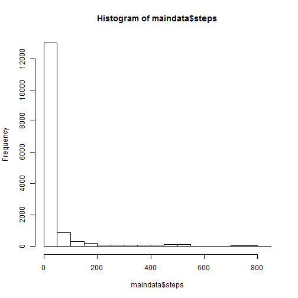
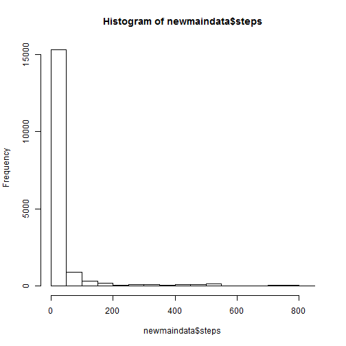
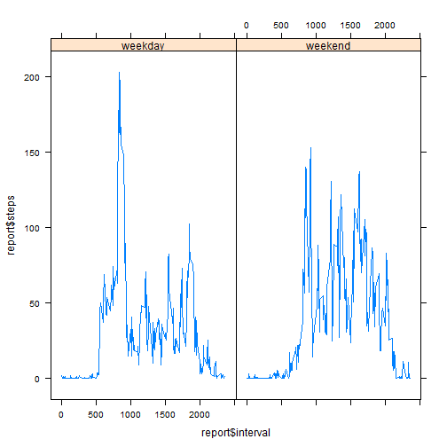

###Loading and preprocessing the data


```r
# read data
  maindata <- read.csv("D:/Rdata/reproduce/assign1/activity.csv",header=T)
```


###Mean of total number of steps taken by day


```r
#Create histogram
hist(maindata$steps)
```

 


```r
#Mean
mean(maindata[,1],na.rm=TRUE) 
```

```
## [1] 37.38
```

```r
#Median
median(maindata[,1],na.rm=TRUE) 
```

```
## [1] 0
```

###Average daily activity pattern


```r
# select non missing values
data <- maindata[complete.cases(maindata),]

#aggregate the data, calculate means
d <- aggregate(data$steps,list(interval=data$interval),mean)
names(d)[2] <- "steps"
```


```r
#plot aggregate data
with(d,plot(interval,steps,type="l"))
```

 

The highest 5-minute interval, on average, is 835

###Imputing missing data


```r
#Sum cases with NA
sum(!complete.cases(maindata))
```

```
## [1] 2304
```

Replace missing data by the value 0  


```r
#Create new data set
newmaindata <- maindata

#Replace NA by 0
newmaindata[is.na(newmaindata)] <- 0
```


```r
#Create histogram
hist(newmaindata$steps)
```

 

New mean and median of new data set


```r
#Mean
mean(newmaindata[,1]) 
```

```
## [1] 32.48
```

```r
#Median
median(newmaindata[,1]) 
```

```
## [1] 0
```

The new mean is lower than the previous one since all the missing values have been replaced by 0.  
The median stayed the same.  
Imputing missing data has changed the average daily number of steps.  

###Difference between Weekdays and Weekends


```r
#Copy new data set with filled-in values
m <- newmaindata

#Convert to date format
m$date <- as.Date(m$date)

#Create a new field to store weekday values
m$day <- weekdays(m$date)

#Split weekdays into two groups: Weekend vs. Weekday
m$daycat <- ifelse(m$day == "Sunday" | m$day == "Saturday",c("weekend"),c("weekday"))

#Build aggregate date
report <- aggregate(m$steps,by=list(m$daycat,m$interval),mean)

#Rename variables
names(report)[1] <- "daycat"
names(report)[2] <- "interval"
names(report)[3] <- "steps"

#Load library Lattice
library(lattice)
```


```r
#Plot report data
xyplot(report$steps ~ report$interval|report$daycat,type="l")
```

 
